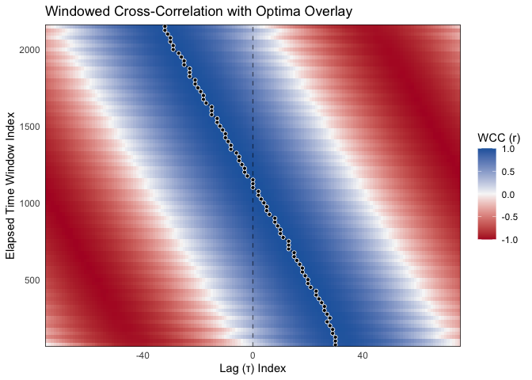

# bsync

<!-- badges: start -->

[](https://app.codecov.io/gh/jmgirard/bsync)
[](https://github.com/jmgirard/bsync/actions/workflows/test-coverage.yaml)
[](https://github.com/jmgirard/bsync/actions/workflows/R-CMD-check.yaml)
[](https://lifecycle.r-lib.org/articles/stages.html#stable)
<!-- badges: end -->

The goal of **bsync** is to provide a modern, high-efficiency R toolkit
for analyzing interpersonal and behavioral synchrony.

While traditional cross-correlation assumes that the association between
two time series is stationary over time, in many psychological and
behavioral contexts (such as interpersonal conversation or synchronized
movement), the lead-lag relationship between individuals is highly
dynamic. **bsync** allows researchers to quantify these nonstationary
associations using highly optimized windowed cross-correlation (WCC),
windowed dynamic time warping (WDTW), windowed Granger causality (WGC),
and optima-extraction algorithms.

Furthermore, the package provides a complete analytical pipeline for
behavioral time series. This includes robust preprocessing functions for
time-bin aggregation, zero-phase signal smoothing, and kinematic
velocity/speed calculations; rigorous hypothesis testing via surrogate
null distributions (pseudo-synchrony testing); and data-driven parameter
guidance tools (`suggest_wcc_params()`, `synchrony_multiverse()`,
`autotune_wcc()`) that match analysis hyperparameters to your signal’s
own timescales.

## Installation

You can install the development version of bsync from
[GitHub](https://github.com/jmgirard/bsync) with:

``` r
# install.packages("pak")
pak::pak("jmgirard/bsync")
```

## Example Workflow

The following example demonstrates a Quick Start WCC pipeline. **New to
bsync?** Start with the [Get started
vignette](https://jmgirard.github.io/bsync/articles/bsync.html) for a
full workflow walkthrough, an estimator decision table, and links to
every deep-dive article. For parameter selection guidance (choosing
`window_size` and `lag_max`), see [Choosing Analysis
Parameters](https://jmgirard.github.io/bsync/articles/choosing-parameters.html).

We will use the included `sim_dyad` dataset, which contains 30 seconds
of simulated 3D motion tracking data for two individuals. In this
simulation, Person A begins by leading a rhythmic movement, they
synchronize in the middle, and Person B takes the lead by the end.

First, we load the package and prepare the data. We highly recommend
smoothing positional data before calculating velocities to prevent
high-frequency noise from amplifying and skewing the cross-correlations.
Here we apply a Savitzky-Golay filter and then calculate the 1D
directional velocity on the Z-axis.

``` r
library(bsync)
library(dplyr)

data("sim_dyad")

# Step 1: Smooth the raw position data and calculate 1D velocity
df <- sim_dyad |>
  mutate(
    z_A_smooth = smooth_signal(z_A, method = "sgolay", window = 5),
    z_B_smooth = smooth_signal(z_B, method = "sgolay", window = 5),
    vel_A = calc_velocity_1d(time, z_A_smooth, fill_edges = TRUE),
    vel_B = calc_velocity_1d(time, z_B_smooth, fill_edges = TRUE)
  )
```

Next, we calculate the windowed cross-correlations. Calling `summary()`
on the resulting object provides a clean, formatted overview of the
analysis settings and the distribution of correlation values.

``` r
# Step 2: Calculate Windowed Cross-Correlations
wcc_results <- wcc(
  x = df$vel_A,
  y = df$vel_B,
  window_size = 150,
  lag_max = 75,
  window_increment = 25,
  lag_increment = 1,
  na.rm = TRUE
)

# View the summary
summary(wcc_results)
#> 
#> ── Windowed Cross-Correlation Analysis ─────────────────────────────────────────
#> Total Windows: 84
#> Total Lags Tested: 151
#> Window Size: 150
#> Max Lag: 75
#> Mean Abs. Fisher's Z: 1.071
#> 
#> ── Cross-Correlation Value Distribution ──
#> 
#>      0%     25%     50%     75%    100% 
#> -0.9984 -0.6830  0.0338  0.7164  0.9986
```

Once the cross-correlations are calculated, we extract the specific lags
that represent the optimal association within each time window.
Summarizing the optima object displays the extraction metadata alongside
an overview of results.

``` r
# Step 3: Extract the Optima (Local Maxima)
optima <- pick_optima(
  obj = wcc_results,
  L_size = 5,
  strict_monotonic = FALSE,
  search_method = "local"
)

# View the optima results
summary(optima)
#> ── WCC Optima Summary ──────────────────────────────────────────────────────────
#> 
#> ── Completeness ──
#> 
#> • Total time windows: 84
#> • Valid optima retained: 84 (100%)
#> • Optima dropped (NA): 0 (0%)
#> 
#> ── Lag Directionality (Leadership) ──
#> 
#> • Positive Lags (x leads y): 41 (48.8%)
#> • Negative Lags (y leads x): 40 (47.6%)
#> • Zero Lags (Simultaneous): 3 (3.6%)
#> 
#> ── Optimum Value Distribution ──
#> 
#>     0%    25%    50%    75%   100% 
#> 0.9739 0.9951 0.9971 0.9976 0.9986
```

Finally, we visualize the resulting correlation landscape. The
underlying heatmap represents the cross-correlation values at each lag
and elapsed time window. The overlaid points and connecting lines
demonstrate the algorithm successfully tracking the shifting lag of
optimum association over the course of the interaction.

``` r
# Step 4: Plot the correlation landscape and overlay the shifting optima
plot_optima_overlay(
  surface_obj = wcc_results,
  optima_df = optima
)
```



### Surrogate Testing for Significance

Psychological and behavioral time series are highly autocorrelated,
which means random noise can sometimes look like genuine interaction. To
verify that our observed synchronization is statistically significant,
we can use the `wcc_surrogate()` function.

This function uses a circular shift method to misalign the two time
series, generating a null distribution of “pseudo-synchrony” that
preserves the natural autocorrelation of the data but breaks the dyadic
interaction.

``` r
# Step 5: Run surrogate analysis to calculate an empirical p-value
# First generate a null distribution via circular shift
set.seed(2026)
null_matrix <- generate_surrogate_circular(y = df$vel_B, n_surrogates = 100)

# Then compare observed WCC against the null distribution
surrogate_results <- wcc_surrogate(
  x = df$vel_A,
  y = df$vel_B,
  y_surrogates = null_matrix,
  window_size = 150,
  lag_max = 75,
  window_increment = 25,
  lag_increment = 1
)

surrogate_results
#> ── WCC Surrogate Analysis (Pseudo-Synchrony) ───────────────────────────────────
#> Permutations: 100
#> Observed Mean Abs. Fisher's Z: 1.071
#> Average Null Mean Abs. Fisher's Z: 1.007
#> Empirical p-value: 0.06
#> ! Observed synchrony is not significantly different from chance.
#> ℹ Note: 100 permutations may be too few for stable p-values.
#> Consider setting `n_surrogates >= 1000` for final reporting.
```

## Where to go next

| Article | What you will learn |
|----|----|
| [Get started](https://jmgirard.github.io/bsync/articles/bsync.html) | Full workflow arc, estimator decision table, reading map |
| [WCC workflow](https://jmgirard.github.io/bsync/articles/wcc-workflow.html) | WCC pipeline: optima, LAI, tidy interface, aggregate statistics |
| [WDTW workflow](https://jmgirard.github.io/bsync/articles/wdtw-workflow.html) | WDTW pipeline: time-warped alignment, optima extraction |
| [WGC workflow](https://jmgirard.github.io/bsync/articles/wgranger-workflow.html) | Windowed Granger Causality: directional F-statistic and p-value plots |
| [Choosing parameters](https://jmgirard.github.io/bsync/articles/choosing-parameters.html) | `suggest_wcc_params()`, `synchrony_multiverse()`, `autotune_wcc()` |
| [Surrogate testing](https://jmgirard.github.io/bsync/articles/surrogate-testing.html) | Circular-shift vs. phase-randomization; best practices |
| [Downsampling](https://jmgirard.github.io/bsync/articles/determine-downsampling.html) | PSD-based guidance for choosing a biologically appropriate sample rate |

## Citation

If you use **bsync** in your research, please cite the package:

``` r
citation("bsync")
#> To cite package 'bsync' in publications use:
#> 
#>   Girard JM (2026). _bsync: Behavioral Synchrony Analyses_. R package
#>   version 0.0.0.9000, <https://jmgirard.github.io/bsync/>.
#> 
#> A BibTeX entry for LaTeX users is
#> 
#>   @Manual{,
#>     title = {bsync: Behavioral Synchrony Analyses},
#>     author = {Jeffrey M. Girard},
#>     year = {2026},
#>     note = {R package version 0.0.0.9000},
#>     url = {https://jmgirard.github.io/bsync/},
#>   }
```

## References

This package builds upon foundational methodology and modern best
practices in behavioral time series analysis. We recommend citing the
following papers to justify the specific analytical steps used in your
pipeline.

### Windowed Cross-Correlation, Peak-Picking & Leadership Asymmetry

The core WCC algorithm, peak-picking logic, and the theoretical
framework for quantifying continuous leader-follower dynamics through
lag extraction are based on:

- Boker, S. M., Rotondo, J. L., Xu, M., & King, K. (2002). Windowed
  cross-correlation and peak picking for the analysis of variability in
  the association between behavioral time series. *Psychological
  Methods, 7*(3), 338.

### Dynamic Time Warping

The core DTW alignment algorithm is based on foundational work by:

- Sakoe, H., & Chiba, S. (1978). Dynamic programming algorithm
  optimization for spoken word recognition. *IEEE Transactions on
  Acoustics, Speech, and Signal Processing, 26*(1), 43-49.

### Windowed Granger Causality

The implementation of rolling autoregressive models to statistically
test for directed information flow is based on the foundational
framework of Granger causality:

- Granger, C. W. J. (1969). Investigating causal relations by
  econometric models and cross-spectral methods. *Econometrica, 37*(3),
  424-438.

### Pseudo-Synchrony & Surrogate Testing

The use of circular-shifted surrogate data to establish a statistical
baseline for true interpersonal synchrony was popularized in behavioral
research by:

- Ramseyer, F., & Tschacher, W. (2011). Nonverbal synchrony in
  psychotherapy: Coordinated body movement reflects relationship quality
  and outcome. *Journal of Consulting and Clinical Psychology, 79*(3),
  284-295.

### Signal Smoothing & Kinematics

The preprocessing pipeline utilizes zero-phase moving averages and
polynomial filtering techniques, while continuous velocity and speed are
computed using standard finite difference kinematics:

- Savitzky, A., & Golay, M. J. (1964). Smoothing and differentiation of
  data by simplified least squares procedures. *Analytical Chemistry,
  36*(8), 1627-1639.
- Winter, D. A. (2009). *Biomechanics and motor control of human
  movement* (4th ed.). John Wiley & Sons.
