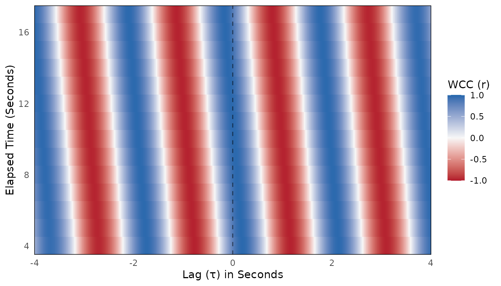
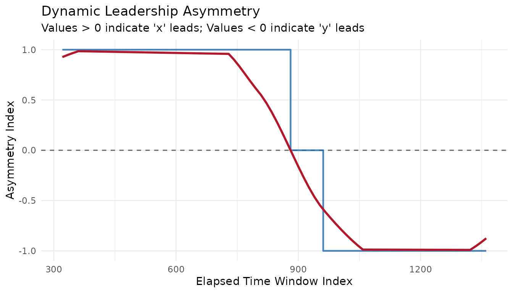
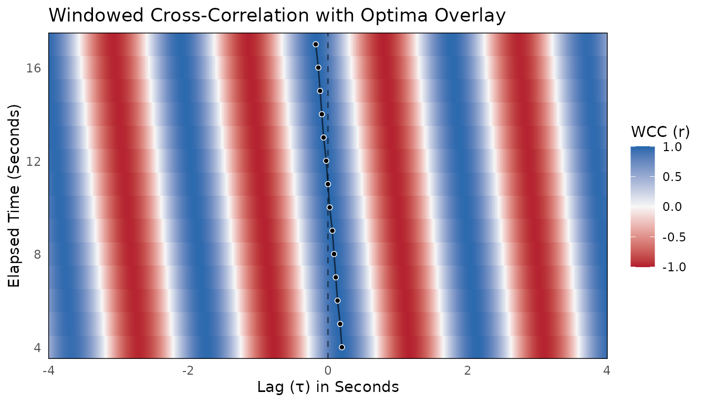

# Get started with bsync

``` r

library(bsync)
```

**bsync** provides a modern, high-efficiency toolkit for analyzing
**interpersonal and behavioral synchrony** in continuous dyadic time
series. It implements windowed estimators of nonstationary lead–lag
structure — Windowed Cross-Correlation (WCC), Windowed Dynamic Time
Warping (WDTW), and Windowed Granger Causality (WGC) — together with a
full preprocessing pipeline, surrogate significance testing, optima
extraction, and parameter guidance tools.

This vignette walks you through the complete workflow from raw data to a
quantified leadership index. It also gives you the decision table you
need to choose the right estimator and points you toward the relevant
deep-dive articles.

## The bsync analysis workflow

A complete behavioral synchrony analysis has five stages:

1.  **Preprocess** — smooth, trim, and compute kinematics from raw
    position data.
2.  **Choose parameters** — select window size and lag ceiling that
    match the signal’s timescales.
3.  **Estimate** — run WCC, WDTW, or WGC on the prepared signals.
4.  **Test significance** — compare the observed statistic against a
    surrogate null distribution.
5.  **Quantify leadership** — extract optima and compute the Leadership
    Asymmetry Index.

The following example walks through all five stages using the built-in
`sim_dyad` dataset, which contains 30 seconds of simulated 3D
motion-tracking data (80 Hz) for two individuals. Person A leads a
rhythmic movement early in the recording, they briefly synchronize, and
Person B takes the lead by the end.

## Step 1: Preprocess

Raw positional data almost always needs smoothing before analysis.
High-frequency noise amplifies when derivatives are calculated,
contaminating the cross-correlations. We apply a Savitzky-Golay filter
and then compute the 1D velocity along the Z-axis.

``` r

library(dplyr)
#> 
#> Attaching package: 'dplyr'
#> The following objects are masked from 'package:stats':
#> 
#>     filter, lag
#> The following objects are masked from 'package:base':
#> 
#>     intersect, setdiff, setequal, union

# Smooth raw positions, then compute 1D velocity
df <- sim_dyad |>
  mutate(
    z_A_sm = smooth_signal(z_A, method = "sgolay", window = 5),
    z_B_sm = smooth_signal(z_B, method = "sgolay", window = 5),
    vel_A  = calc_velocity_1d(time, z_A_sm, fill_edges = TRUE),
    vel_B  = calc_velocity_1d(time, z_B_sm, fill_edges = TRUE)
  )
```

Other preprocessing helpers available in bsync:
[`trim_edges()`](https://jmgirard.github.io/bsync/reference/trim_edges.md)
(drop polynomial-smoothing artifacts),
[`aggregate_by_time()`](https://jmgirard.github.io/bsync/reference/aggregate_by_time.md)
/
[`downsample_signal()`](https://jmgirard.github.io/bsync/reference/downsample_signal.md)
(reduce sample rate),
[`diagnose_ts_gaps()`](https://jmgirard.github.io/bsync/reference/diagnose_ts_gaps.md)
/
[`impute_ts_gaps()`](https://jmgirard.github.io/bsync/reference/impute_ts_gaps.md)
(handle missing values), and
[`evaluate_signal_power()`](https://jmgirard.github.io/bsync/reference/evaluate_signal_power.md)
(PSD-based downsampling guidance; see
[`vignette("determine-downsampling")`](https://jmgirard.github.io/bsync/articles/determine-downsampling.md)).

## Step 2: Choose parameters

The two key hyperparameters for WCC — `window_size` (samples per window)
and `lag_max` (maximum temporal offset to test) — should be matched to
the dominant behavioral timescale. `bsync` provides three complementary
tools (detailed in
[`vignette("choosing-parameters")`](https://jmgirard.github.io/bsync/articles/choosing-parameters.md)):

- **[`suggest_wcc_params()`](https://jmgirard.github.io/bsync/reference/suggest_wcc_params.md)**
  — PSD-driven starting values for a single dyad.
- **[`synchrony_multiverse()`](https://jmgirard.github.io/bsync/reference/synchrony_multiverse.md)**
  — sweep the full grid and view the specification curve.
- **[`autotune_wcc()`](https://jmgirard.github.io/bsync/reference/autotune_wcc.md)**
  — select parameters that generalize across a multi-dyad dataset.

For this quick-start we use hard-coded values that match the 0.5 Hz
dominant cycle in `sim_dyad` (window ≈ 4 cycles at 80 Hz = 640 samples;
lag ≈ half the window = 320 samples). In practice, always derive these
from your own signal.

## Step 3: Estimate

With the data prepared and parameters chosen, run
[`wcc()`](https://jmgirard.github.io/bsync/reference/wcc.md). The
function returns a `wcc_res` object that carries the full windowed
surface, the aggregate Fisher’s Z, and all settings.

``` r

wcc_res <- wcc(
  x                = df$vel_A,
  y                = df$vel_B,
  window_size      = 640,
  lag_max          = 320,
  window_increment = 80,
  lag_increment    = 1
)

summary(wcc_res)
#> 
#> ── Windowed Cross-Correlation Analysis ─────────────────────────────────────────
#> Total Windows: 14
#> Total Lags Tested: 641
#> Window Size: 640
#> Max Lag: 320
#> Mean Abs. Fisher's Z: 0.9729
#> 
#> ── Cross-Correlation Value Distribution ──
#> 
#>      0%     25%     50%     75%    100% 
#> -0.9755 -0.6768  0.0550  0.7400  0.9764
```

Plot the surface to see the shifting correlation landscape:

``` r

plot(wcc_res, time_step = 1 / 80) # time_step converts frames → seconds
```



The [`plot()`](https://rdrr.io/r/graphics/plot.default.html),
[`print()`](https://rdrr.io/r/base/print.html),
[`summary()`](https://rdrr.io/r/base/summary.html),
[`tidy()`](https://generics.r-lib.org/reference/tidy.html), and
[`glance()`](https://generics.r-lib.org/reference/glance.html) methods
work identically for `wdtw_res` and `wgranger_res` objects — the shared
`bsync_surface` superclass ensures a consistent API across all three
estimators.

## Step 4: Test significance

Because behavioral time series are autocorrelated, a high
cross-correlation can occur purely by chance. Surrogate testing builds
an empirical null distribution by breaking the dyadic alignment while
preserving each person’s individual signal characteristics.

``` r

set.seed(2026)

# Generate 200 circular-shift surrogates (use >= 1000 for publication)
null_mat <- generate_surrogate_circular(
  y            = df$vel_B,
  n_surrogates = 200L,
  lag_max      = 320
)

# Compare observed WCC against the null
surr_res <- wcc_surrogate(
  x                = df$vel_A,
  y                = df$vel_B,
  y_surrogates     = null_mat,
  window_size      = 640,
  lag_max          = 320,
  window_increment = 80,
  lag_increment    = 1
)

print(surr_res)
```

For large or computationally expensive analyses, set a parallel plan
before running: `future::plan(future::multisession, workers = 4)`. See
[`vignette("surrogate-testing")`](https://jmgirard.github.io/bsync/articles/surrogate-testing.md)
for a thorough treatment of surrogate methods and when to use phase
randomization instead.

## Step 5: Extract optima and quantify leadership

The full WCC surface tells us *how much* synchrony exists at each
moment. To track *who is leading*, we extract the lag that maximizes
correlation within each window
([`pick_optima()`](https://jmgirard.github.io/bsync/reference/pick_optima.md)),
then summarize those lags into a continuous Leadership Asymmetry Index
([`leadership_asymmetry()`](https://jmgirard.github.io/bsync/reference/leadership_asymmetry.md)).

``` r

wcc_res |>
  pick_optima(L_size = 9) |>
  leadership_asymmetry(epoch_size = 3, min_valid = 1) |>
  plot(smooth = TRUE)
#> `geom_smooth()` using formula = 'y ~ x'
```



The LAI ranges from −1 (y leads entirely) to +1 (x leads entirely). In
this plot you can see Person A leading early, a transition period in the
middle, and Person B leading by the end — exactly as simulated in
`sim_dyad`.

Visualize the optima overlaid on the surface with
[`plot_optima_overlay()`](https://jmgirard.github.io/bsync/reference/plot_optima_overlay.md):

``` r

optima_df <- pick_optima(wcc_res, L_size = 9)
plot_optima_overlay(wcc_res, optima_df, time_step = 1 / 80, show_zero_lag = TRUE)
```



------------------------------------------------------------------------

## Which estimator should I use?

|  | **WCC** | **WDTW** | **WGC** |
|----|----|----|----|
| **Measures** | Linear shape & amplitude similarity | Shape similarity (time-warped) | Directed predictive coupling |
| **Best for** | Continuous kinematics, vocal pitch, physiological signals with known lag range | Mimicry where one person is faster/slower | Proving direction of information flow |
| **Not for** | Variable execution speeds; categorical data | Exact-timing analyses; very noisy data | Unknown lags; non-linear systems; categorical data |
| **Output** | Correlation surface (higher = more synchrony) | Distance surface (lower = more synchrony) | F-statistic surface, both directions |
| **Key parameter** | `window_size`, `lag_max` | `window_size`, `lag_max` | `window_size`, `ar_order` |
| **Deep dive** | [`vignette("wcc-workflow")`](https://jmgirard.github.io/bsync/articles/wcc-workflow.md) | [`vignette("wdtw-workflow")`](https://jmgirard.github.io/bsync/articles/wdtw-workflow.md) | [`vignette("wgranger-workflow")`](https://jmgirard.github.io/bsync/articles/wgranger-workflow.md) |

If you are unsure, start with WCC — it is the most widely used estimator
in behavioral synchrony research and the one for which
[`suggest_wcc_params()`](https://jmgirard.github.io/bsync/reference/suggest_wcc_params.md)
and
[`autotune_wcc()`](https://jmgirard.github.io/bsync/reference/autotune_wcc.md)
provide the most direct guidance.

------------------------------------------------------------------------

## Where to go next

| Article | What you will learn |
|----|----|
| [`vignette("wcc-workflow")`](https://jmgirard.github.io/bsync/articles/wcc-workflow.md) | Full WCC pipeline with optima, LAI, tidy interface, and the two aggregate statistics (`mean_abs_z` vs. `peak`) |
| [`vignette("wdtw-workflow")`](https://jmgirard.github.io/bsync/articles/wdtw-workflow.md) | WDTW step-by-step with surrogate testing and optima extraction |
| [`vignette("wgranger-workflow")`](https://jmgirard.github.io/bsync/articles/wgranger-workflow.md) | WGC step-by-step with F-statistic and p-value plots |
| [`vignette("choosing-parameters")`](https://jmgirard.github.io/bsync/articles/choosing-parameters.md) | Data-driven parameter selection: [`suggest_wcc_params()`](https://jmgirard.github.io/bsync/reference/suggest_wcc_params.md), [`synchrony_multiverse()`](https://jmgirard.github.io/bsync/reference/synchrony_multiverse.md), [`autotune_wcc()`](https://jmgirard.github.io/bsync/reference/autotune_wcc.md), and [`select_specification()`](https://jmgirard.github.io/bsync/reference/select_specification.md) |
| [`vignette("surrogate-testing")`](https://jmgirard.github.io/bsync/articles/surrogate-testing.md) | When to use circular-shift vs. phase-randomization surrogates; best practices |
| [`vignette("determine-downsampling")`](https://jmgirard.github.io/bsync/articles/determine-downsampling.md) | How to choose a biologically appropriate sample rate from PSD diagnostics |
