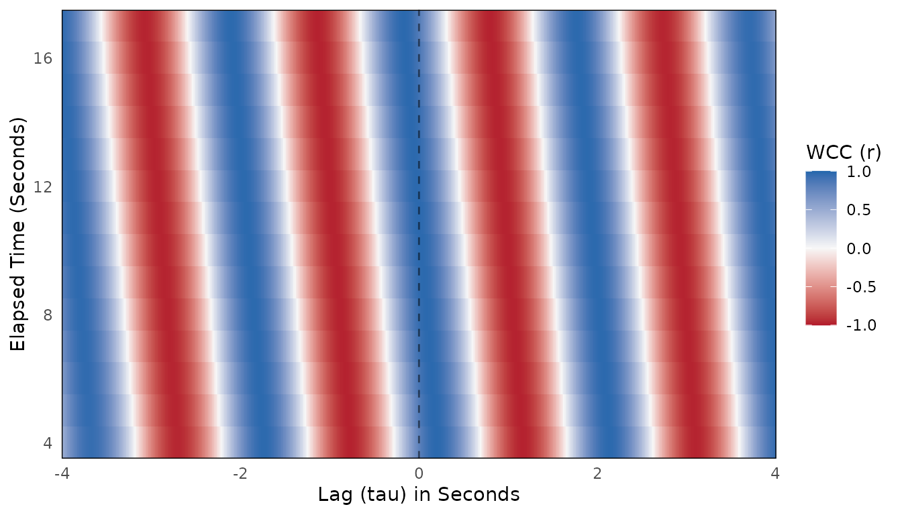
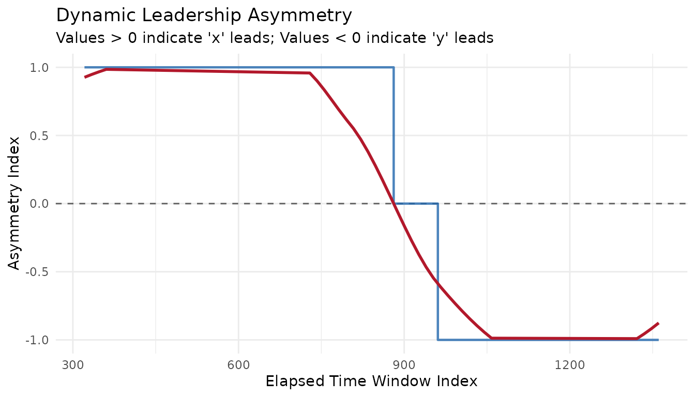
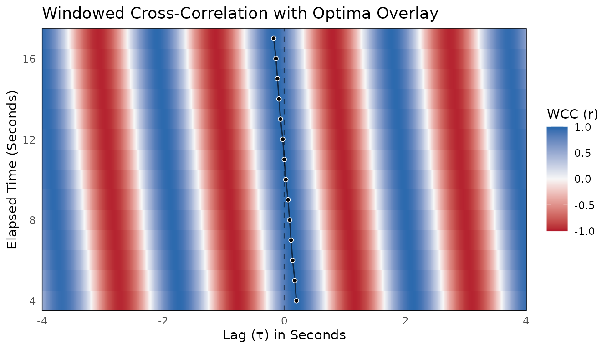

# Get started with bsync

``` r

library(bsync)
```

**bsync** provides a modern, high-efficiency toolkit for analyzing
**interpersonal and behavioral synchrony** in continuous dyadic time
series. It implements windowed estimators of nonstationary lead–lag
structure — Windowed Cross-Correlation (WCC), Windowed Dynamic Time
Warping (WDTW), and Windowed Granger Causality (WGC) — together with a
full preprocessing pipeline, surrogate significance testing, optima
extraction, and parameter guidance tools.

This vignette walks you through the complete workflow from raw data to a
quantified leadership index. It also gives you the decision table you
need to choose the right estimator and points you toward the relevant
deep-dive articles.

## The bsync analysis workflow

A complete behavioral synchrony analysis moves through five stages:

1.  **Condition the signal** — diagnose gaps, put every signal on a
    common, behaviorally appropriate sample rate, and smooth out
    tracking jitter.
2.  **Fix the timescale** — derive the dominant behavioral cycle *once,
    from the whole dataset*, and use it to center your window and lag
    choices.
3.  **Decide parameters honestly** — rather than trusting a single
    window, sweep a grid and report how robust the synchrony is to that
    choice (and avoid selecting parameters to maximize an effect you
    then re-test on the same data).
4.  **Estimate and test** — run WCC, WDTW, or WGC and compare the
    observed statistic against a matched-null surrogate distribution.
5.  **Characterize** — extract optima and quantify the shifting lead–lag
    structure with the Leadership Asymmetry Index.

If you remember one sentence, make it this one:

> **Clean → put on a common rate and smooth → set the timescale from the
> whole dataset → sweep a grid and report matched-null effect-size
> robustness (not a single tuned window) → confirm with ≥ 1000
> surrogates → characterize the lag structure and leadership.**

### From raw data to a result: the full recipe

With your own raw data (irregular timestamps, dropped frames, an
arbitrary sample rate), the arc looks like this. It is shown here as a
reference recipe; the runnable example below demonstrates the core of it
on clean simulated data.

``` r

# 0. Condition each signal ---------------------------------------------------
diagnose_ts_gaps(raw$x)                       # how much is missing, and in what runs?
raw$x <- impute_ts_gaps(raw$x, maxgap = 5)    # bridge only short gaps; long gaps stay NA

# 1. Put signals on a common, behaviorally appropriate rate, then smooth ------
ps <- evaluate_signal_power(raw[c("x", "y")], sample_rate = 240)  # PSD downsampling guidance
df <- aggregate_by_time(raw, time_var = t, bin_width = ps$recommended_bin_width_sec)
df$x <- smooth_signal(df$x, method = "sgolay", window = 11)       # zero-phase; window ~ behavior
df$y <- smooth_signal(df$y, method = "sgolay", window = 11)

# 2. Fix the timescale from the WHOLE dataset, not one dyad -------------------
ps_all <- evaluate_signal_power(all_signals, sample_rate = fs)
params <- suggest_wcc_params(
  df$x, df$y,
  sample_rate = fs,
  event_duration_sec = 1 / ps_all$primary_cutoff_freq
)

# 3. Decide parameters honestly: sweep a grid, report robustness --------------
mv <- synchrony_multiverse(
  df$x, df$y,
  estimator = "wcc", sample_rate = fs,
  window_sec = c(2, 4, 6), lag_sec = c(1, 2, 3),
  surrogate_method = c("phase", "circular"),
  n_surrogates = 1000
)
glance(mv)   # pct_significant, sign_consistent, median ES + IQR across the grid
plot(mv)     # specification curve

# 4. Confirmatory test with the chosen (not tuned-and-reused) parameters ------
null <- generate_surrogate_phase(df$y, n_surrogates = 1000)
wcc_surrogate(df$x, df$y, null, window_size = w, lag_max = l)

# 5. Characterize the lead-lag structure --------------------------------------
wcc(df$x, df$y, window_size = w, lag_max = l) |>
  pick_optima(L_size = 9) |>
  leadership_asymmetry() |>
  plot(smooth = TRUE)
```

A note on step 3 that matters for publishable claims:
[`autotune_wcc()`](https://jmgirard.github.io/bsync/reference/autotune_wcc.md)
*selects* the parameters that maximize the effect size, so testing
significance with those same parameters on the same dyads is circular
(double-dipping). Either tune on a pilot subset and confirm on held-out
dyads, or — the simpler route for most users — report the multiverse
robustness across the grid instead of a single tuned “winner.” See
[`vignette("choosing-parameters")`](https://jmgirard.github.io/bsync/articles/choosing-parameters.md)
for the full treatment.

### A concrete demonstration on `sim_dyad`

The following example walks through the core of this workflow using the
built-in `sim_dyad` dataset, which contains 30 seconds of simulated 3D
motion-tracking data (80 Hz) for two individuals. Person A leads a
rhythmic movement early in the recording, they briefly synchronize, and
Person B takes the lead by the end. Because `sim_dyad` is already clean
and regularly sampled, we start at the smoothing step.

## Step 1: Preprocess

Raw positional data almost always needs smoothing before analysis.
High-frequency noise amplifies when derivatives are calculated,
contaminating the cross-correlations. We apply a Savitzky-Golay filter
and then compute the 1D velocity along the Z-axis.

``` r

library(dplyr)
#> 
#> Attaching package: 'dplyr'
#> The following objects are masked from 'package:stats':
#> 
#>     filter, lag
#> The following objects are masked from 'package:base':
#> 
#>     intersect, setdiff, setequal, union

# Smooth raw positions, then compute 1D velocity
df <- sim_dyad |>
  mutate(
    z_A_sm = smooth_signal(z_A, method = "sgolay", window = 5),
    z_B_sm = smooth_signal(z_B, method = "sgolay", window = 5),
    vel_A  = calc_velocity_1d(time, z_A_sm, fill_edges = TRUE),
    vel_B  = calc_velocity_1d(time, z_B_sm, fill_edges = TRUE)
  )
```

Other preprocessing helpers available in bsync:
[`trim_edges()`](https://jmgirard.github.io/bsync/reference/trim_edges.md)
(drop polynomial-smoothing artifacts),
[`aggregate_by_time()`](https://jmgirard.github.io/bsync/reference/aggregate_by_time.md)
/
[`downsample_signal()`](https://jmgirard.github.io/bsync/reference/downsample_signal.md)
(reduce sample rate),
[`diagnose_ts_gaps()`](https://jmgirard.github.io/bsync/reference/diagnose_ts_gaps.md)
/
[`impute_ts_gaps()`](https://jmgirard.github.io/bsync/reference/impute_ts_gaps.md)
(handle missing values), and
[`evaluate_signal_power()`](https://jmgirard.github.io/bsync/reference/evaluate_signal_power.md)
(PSD-based downsampling guidance; see
[`vignette("determine-downsampling")`](https://jmgirard.github.io/bsync/articles/determine-downsampling.md)).

## Step 2: Choose parameters

The two key hyperparameters for WCC — `window_size` (samples per window)
and `lag_max` (maximum temporal offset to test) — should be matched to
the dominant behavioral timescale. There is no single “correct” window,
so the honest goal is not to find one magic value but to check that your
conclusion holds across a sensible range. `bsync` provides three
complementary tools (detailed in
[`vignette("choosing-parameters")`](https://jmgirard.github.io/bsync/articles/choosing-parameters.md)):

- **[`suggest_wcc_params()`](https://jmgirard.github.io/bsync/reference/suggest_wcc_params.md)**
  — PSD-driven *starting center* for the sweep (derive the timescale
  from your whole dataset via `event_duration_sec`, not one dyad).
- **[`synchrony_multiverse()`](https://jmgirard.github.io/bsync/reference/synchrony_multiverse.md)**
  — sweep the full grid and report matched-null effect-size robustness;
  this is the recommended default for reporting.
- **[`autotune_wcc()`](https://jmgirard.github.io/bsync/reference/autotune_wcc.md)**
  — select a single parameter set that generalizes across a multi-dyad
  dataset (mind the circularity caution above when you then report
  significance).

For this quick-start we use hard-coded values that match the 0.5 Hz
dominant cycle in `sim_dyad` (window ≈ 4 cycles at 80 Hz = 640 samples;
lag ≈ half the window = 320 samples). In practice, always derive these
from your own signal.

## Step 3: Estimate

With the data prepared and parameters chosen, run
[`wcc()`](https://jmgirard.github.io/bsync/reference/wcc.md). The
function returns a `wcc_res` object that carries the full windowed
surface, the aggregate Fisher’s Z, and all settings.

``` r

wcc_res <- wcc(
  x                = df$vel_A,
  y                = df$vel_B,
  window_size      = 640,
  lag_max          = 320,
  window_increment = 80,
  lag_increment    = 1
)

summary(wcc_res)
#> 
#> ── Windowed Cross-Correlation Analysis ─────────────────────────────────────────
#> Total Windows: 14
#> Total Lags Tested: 641
#> Window Size: 640
#> Max Lag: 320
#> Mean Abs. Fisher's Z: 0.9729
#> 
#> ── Cross-Correlation Value Distribution ──
#> 
#>      0%     25%     50%     75%    100% 
#> -0.9755 -0.6768  0.0550  0.7400  0.9764
```

Plot the surface to see the shifting correlation landscape:

``` r

plot(wcc_res, time_step = 1 / 80) # time_step converts frames → seconds
```



The [`plot()`](https://rdrr.io/r/graphics/plot.default.html),
[`print()`](https://rdrr.io/r/base/print.html),
[`summary()`](https://rdrr.io/r/base/summary.html),
[`tidy()`](https://generics.r-lib.org/reference/tidy.html), and
[`glance()`](https://generics.r-lib.org/reference/glance.html) methods
work identically for `wdtw_res` and `wgranger_res` objects — the shared
`bsync_surface` superclass ensures a consistent API across all three
estimators.

## Step 4: Test significance

Because behavioral time series are autocorrelated, a high
cross-correlation can occur purely by chance. Surrogate testing builds
an empirical null distribution by breaking the dyadic alignment while
preserving each person’s individual signal characteristics.

``` r

set.seed(2026)

# Generate 200 circular-shift surrogates (use >= 1000 for publication)
null_mat <- generate_surrogate_circular(
  y            = df$vel_B,
  n_surrogates = 200L,
  lag_max      = 320
)

# Compare observed WCC against the null
surr_res <- wcc_surrogate(
  x                = df$vel_A,
  y                = df$vel_B,
  y_surrogates     = null_mat,
  window_size      = 640,
  lag_max          = 320,
  window_increment = 80,
  lag_increment    = 1
)

print(surr_res)
```

For large or computationally expensive analyses, set a parallel plan
before running: `future::plan(future::multisession, workers = 4)`. See
[`vignette("surrogate-testing")`](https://jmgirard.github.io/bsync/articles/surrogate-testing.md)
for a thorough treatment of surrogate methods and when to use phase
randomization instead.

## Step 5: Extract optima and quantify leadership

The full WCC surface tells us *how much* synchrony exists at each
moment. To track *who is leading*, we extract the lag that maximizes
correlation within each window
([`pick_optima()`](https://jmgirard.github.io/bsync/reference/pick_optima.md)),
then summarize those lags into a continuous Leadership Asymmetry Index
([`leadership_asymmetry()`](https://jmgirard.github.io/bsync/reference/leadership_asymmetry.md)).

``` r

wcc_res |>
  pick_optima(L_size = 9) |>
  leadership_asymmetry(epoch_size = 3, min_valid = 1) |>
  plot(smooth = TRUE)
#> `geom_smooth()` using formula = 'y ~ x'
```



The LAI ranges from −1 (y leads entirely) to +1 (x leads entirely). In
this plot you can see Person A leading early, a transition period in the
middle, and Person B leading by the end — exactly as simulated in
`sim_dyad`.

Visualize the optima overlaid on the surface with
[`plot_optima_overlay()`](https://jmgirard.github.io/bsync/reference/plot_optima_overlay.md):

``` r

optima_df <- pick_optima(wcc_res, L_size = 9)
plot_optima_overlay(wcc_res, optima_df, time_step = 1 / 80, show_zero_lag = TRUE)
```



------------------------------------------------------------------------

## Which estimator should I use?

|  | **WCC** | **WDTW** | **WGC** |
|----|----|----|----|
| **Measures** | Linear shape & amplitude similarity | Shape similarity (time-warped) | Directed predictive coupling |
| **Best for** | Continuous kinematics, vocal pitch, physiological signals with known lag range | Mimicry where one person is faster/slower | Proving direction of information flow |
| **Not for** | Variable execution speeds; categorical data | Exact-timing analyses; very noisy data | Unknown lags; non-linear systems; categorical data |
| **Output** | Correlation surface (higher = more synchrony) | Distance surface (lower = more synchrony) | F-statistic surface, both directions |
| **Key parameter** | `window_size`, `lag_max` | `window_size`, `lag_max` | `window_size`, `ar_order` |
| **Deep dive** | [`vignette("wcc-workflow")`](https://jmgirard.github.io/bsync/articles/wcc-workflow.md) | [`vignette("wdtw-workflow")`](https://jmgirard.github.io/bsync/articles/wdtw-workflow.md) | [`vignette("wgranger-workflow")`](https://jmgirard.github.io/bsync/articles/wgranger-workflow.md) |

If you are unsure, start with WCC — it is the most widely used estimator
in behavioral synchrony research and the one for which
[`suggest_wcc_params()`](https://jmgirard.github.io/bsync/reference/suggest_wcc_params.md)
and
[`autotune_wcc()`](https://jmgirard.github.io/bsync/reference/autotune_wcc.md)
provide the most direct guidance.

### WCC vs. WDTW: which kind of similarity do you mean?

WCC and WDTW both measure moment-to-moment similarity, but they answer
different questions, and the right choice hinges on **how the timing of
the coordination behaves within a window**.

**WCC asks: “at a fixed time offset, do the two signals rise and fall
together?”** Inside each window it slides one signal by a *constant* lag
and computes a linear (Pearson) correlation. This is the right model
when the coupling is a roughly steady lead–lag over the window and the
association is linear. Its great strengths are interpretability and
direction: the sign of the optimal lag tells you *who leads*, which is
exactly what
[`pick_optima()`](https://jmgirard.github.io/bsync/reference/pick_optima.md)
and
[`leadership_asymmetry()`](https://jmgirard.github.io/bsync/reference/leadership_asymmetry.md)
exploit. It is also cheap, so full surrogate testing and multiverse
sweeps are affordable.

**WDTW asks: “are the two signals the same shape if I’m allowed to
locally stretch and compress time?”** It finds the minimum-cost elastic
alignment between the two window segments, so it can match the *same
gesture performed at different or varying speeds* — one partner faster,
a tempo that drifts, a lag that changes *within* the window. That
flexibility is the point: use WDTW for mimicry and pattern recurrence
when exact timing is not fixed. The costs are that it is `O(window²)`
per cell (much heavier), returns a distance rather than a correlation,
and gives a weaker read on directionality, because the warping itself
blurs “who led.” On very noisy signals it can also over-align, finding
warps that fit noise.

Rules of thumb:

- **Reach for WCC** when the lag is roughly constant within a window,
  the relationship is linear, you want a clean leadership direction, or
  you have a lot of data.
- **Reach for WDTW** when partners perform the same behavior at
  *different or variable speeds* and you care about shape recurrence
  more than exact timing.
- **They are complementary, not exclusive.** Because
  [`synchrony_multiverse()`](https://jmgirard.github.io/bsync/reference/synchrony_multiverse.md)
  runs all three estimators, a robustness-minded analysis can check
  whether the same synchrony conclusion survives a change of estimator —
  strong evidence when it does.

------------------------------------------------------------------------

## Where to go next

| Article | What you will learn |
|----|----|
| [`vignette("wcc-workflow")`](https://jmgirard.github.io/bsync/articles/wcc-workflow.md) | Full WCC pipeline with optima, LAI, tidy interface, and the two aggregate statistics (`mean_abs_z` vs. `peak`) |
| [`vignette("wdtw-workflow")`](https://jmgirard.github.io/bsync/articles/wdtw-workflow.md) | WDTW step-by-step with surrogate testing and optima extraction |
| [`vignette("wgranger-workflow")`](https://jmgirard.github.io/bsync/articles/wgranger-workflow.md) | WGC step-by-step with F-statistic and p-value plots |
| [`vignette("choosing-parameters")`](https://jmgirard.github.io/bsync/articles/choosing-parameters.md) | Data-driven parameter selection: [`suggest_wcc_params()`](https://jmgirard.github.io/bsync/reference/suggest_wcc_params.md), [`synchrony_multiverse()`](https://jmgirard.github.io/bsync/reference/synchrony_multiverse.md), [`autotune_wcc()`](https://jmgirard.github.io/bsync/reference/autotune_wcc.md), and [`select_specification()`](https://jmgirard.github.io/bsync/reference/select_specification.md) |
| [`vignette("surrogate-testing")`](https://jmgirard.github.io/bsync/articles/surrogate-testing.md) | When to use circular-shift vs. phase-randomization surrogates; best practices |
| [`vignette("determine-downsampling")`](https://jmgirard.github.io/bsync/articles/determine-downsampling.md) | How to choose a biologically appropriate sample rate from PSD diagnostics |
