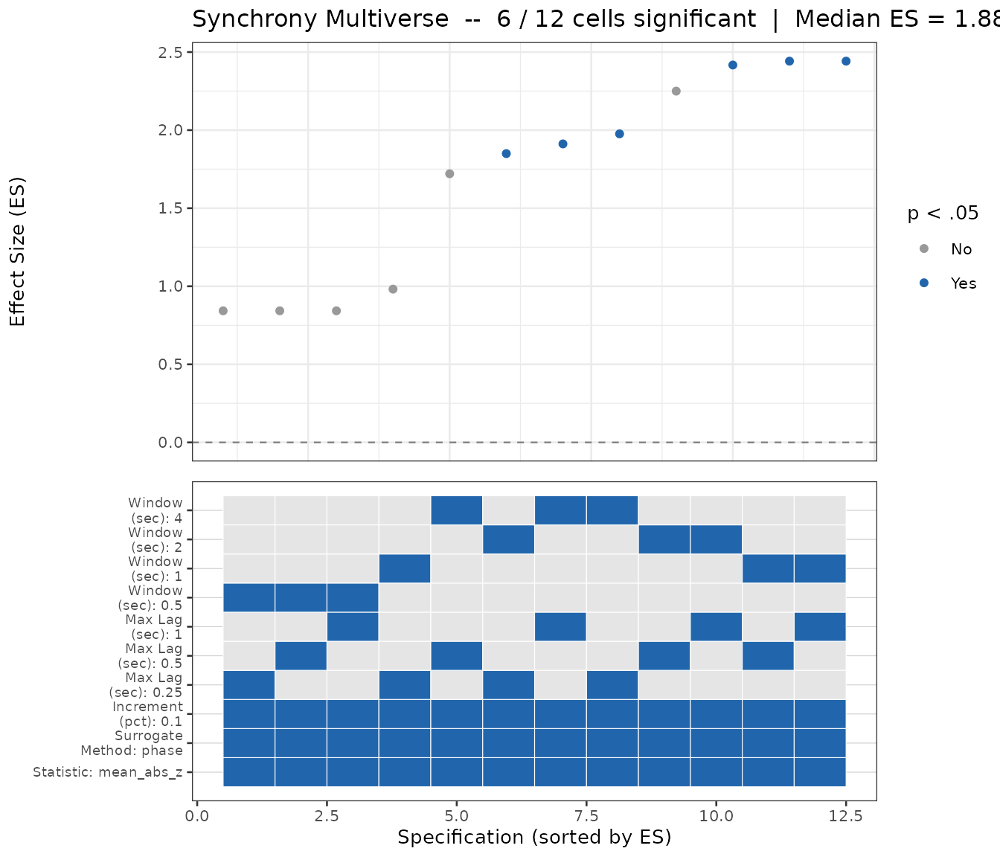

# Choosing Analysis Parameters

``` r

library(bsync)
```

## The Parameter-Selection Problem

There is no single “correct” set of WCC hyperparameters. The optimal
window size and lag ceiling depend on the timescale of the behavior you
are measuring, and those timescales vary enormously: a mother-infant
gaze interaction unfolds on a completely different timescale than a
high-speed athletic exchange.

This vignette shows three tools `bsync` provides to address this
problem, in order from quick-and-informed to thorough-and-multi-dyad:

1.  **[`suggest_wcc_params()`](https://jmgirard.github.io/bsync/reference/suggest_wcc_params.md)**
    — PSD-based starting values for a single dyad.
2.  **[`synchrony_multiverse()`](https://jmgirard.github.io/bsync/reference/synchrony_multiverse.md)**
    — sweep the full parameter grid and view the specification curve.
3.  **[`autotune_wcc()`](https://jmgirard.github.io/bsync/reference/autotune_wcc.md)**
    — automatically select parameters that generalize across a dyad
    dataset.

[`select_specification()`](https://jmgirard.github.io/bsync/reference/select_specification.md)
underpins step 3 and is exported for advanced users who want to apply
the selection rule directly to a list of multiverse results.

> **Note:** Steps 1 and 3 are WCC-specific helpers.
> [`synchrony_multiverse()`](https://jmgirard.github.io/bsync/reference/synchrony_multiverse.md)
> in step 2 supports all three estimators (`"wcc"`, `"wdtw"`,
> `"granger"`), so you can run a parameter sweep for any estimator.

## 1. Data-Driven Starting Values: `suggest_wcc_params()`

When you have a representative series in hand, let the signal tell you
its own dominant timescale via power spectral density (PSD):

``` r

fs <- 80 # sampling rate of sim_dyad (Hz)

params <- suggest_wcc_params(
  x           = sim_dyad$z_A,
  y           = sim_dyad$z_B,
  sample_rate = fs
)
#> ℹ PSD dominant cycle: 0.8 s (cutoff 1.25 Hz).
#> Warning: Requested `max_delay_sec` (3 s = 240 samples) exceeds window_size/2 (128).
#> ℹ Capping `lag_max` at 128 (= 1.6 s).
#> 
#> ── Suggested WCC Parameters ────────────────────────────────────────────────────
#> window_size: 256 (3.2 s)
#> lag_max: 128 (1.6 s)
#> window_increment: 128 (50% overlap)
#> lag_increment: 1
params
#> $window_size
#> [1] 256
#> 
#> $lag_max
#> [1] 128
#> 
#> $window_increment
#> [1] 128
#> 
#> $lag_increment
#> [1] 1
```

The PSD identifies the 0.5 Hz dominant cycle (~2 s period). The
4-cycles-per-window heuristic (Boker et al., 2002) then gives
`window_size = round(2 * 4 * 80) = 640 samples`, subject to the hard
constraints (see
[`?suggest_wcc_params`](https://jmgirard.github.io/bsync/reference/suggest_wcc_params.md)):

- `window_size >= 2 * lag_max` (SUSY lag-cap rule)
- `window_size <= length(x) / 2` (series-length ceiling)
- Minimum-samples floor for a stable *r*

If you already know the behavioral timescale from theory, pass it
directly as an override:

``` r

params_expert <- suggest_wcc_params(
  x                  = sim_dyad$z_A,
  y                  = sim_dyad$z_B,
  sample_rate        = fs,
  event_duration_sec = 2 # 0.5 Hz cycle = 2 s
)
#> ℹ Using supplied `event_duration_sec` = 2 s.
#> 
#> ── Suggested WCC Parameters ────────────────────────────────────────────────────
#> window_size: 640 (8 s)
#> lag_max: 240 (3 s)
#> window_increment: 320 (50% overlap)
#> lag_increment: 1
params_expert
#> $window_size
#> [1] 640
#> 
#> $lag_max
#> [1] 240
#> 
#> $window_increment
#> [1] 320
#> 
#> $lag_increment
#> [1] 1
```

Either way, plug the result directly into
[`wcc()`](https://jmgirard.github.io/bsync/reference/wcc.md):

``` r

results <- wcc(
  x                = sim_dyad$z_A,
  y                = sim_dyad$z_B,
  window_size      = params$window_size,
  lag_max          = params$lag_max,
  window_increment = params$window_increment,
  lag_increment    = params$lag_increment
)
generics::glance(results)
#> # A tibble: 1 × 7
#>   mean_abs_z n_windows window_size window_increment lag_max lag_increment
#>        <dbl>     <int>       <dbl>            <dbl>   <int>         <int>
#> 1       1.05        14         256              128     128             1
#> # ℹ 1 more variable: statistic <chr>
```

### Window overlap (`overlap_pct`)

[`suggest_wcc_params()`](https://jmgirard.github.io/bsync/reference/suggest_wcc_params.md)
also derives a `window_increment` from `overlap_pct`, which controls how
far the window shifts on each step:

- **0% overlap** (`overlap_pct = 0`): the window jumps completely
  forward — fastest, but lowest temporal resolution.
- **50–75% overlap** (the default `0.5`): a balanced choice for
  exploratory analysis.
- **Increment of 1** (near-complete overlap): highest resolution, and
  feasible for typical datasets because `bsync` uses a C++ prefix-sum
  core.

## 2. Visualizing the Specification Curve: `synchrony_multiverse()`

A single parameter set is a single analytic choice. The synchrony
multiverse shows you how your conclusion changes across the full grid of
defensible choices. The headline metric is **effect size vs. the
matched-null surrogate**, not raw synchrony (which autocorrelation
inflates).

``` r

# Sweep window sizes 0.5 s to 4 s and lag from 0.25 s to 1 s
set.seed(2026)
mv <- synchrony_multiverse(
  x            = sim_dyad$z_A,
  y            = sim_dyad$z_B,
  estimator    = "wcc",
  sample_rate  = 80,
  window_sec   = c(0.5, 1, 2, 4),
  lag_sec      = c(0.25, 0.5, 1),
  n_surrogates = 100L
)

mv
#> 
#> ── Synchrony Multiverse Analysis (wcc) ─────────────────────────────────────────
#> Specifications: 12 (12 computable)
#> Surrogates per cell: 100
#> Significant (p < .05): 6 of 12 (50%)
#> Median ES: 1.881 [IQR: 1.345]
#> Sign-consistent (sig. cells): 100%
```

``` r

generics::glance(mv)
#> # A tibble: 1 × 9
#>   estimator n_cells n_valid n_significant pct_significant median_es iqr_es
#>   <chr>       <int>   <int>         <int>           <dbl>     <dbl>  <dbl>
#> 1 wcc            12      12             6             0.5      1.88   1.34
#> # ℹ 2 more variables: sign_consistent <dbl>, n_surrogates <int>
```

``` r

plot(mv)
```



The specification curve (top panel) sorts parameter specifications by
effect size; the choice dashboard (bottom panel) reveals which analytic
choices drive the result. If synchrony is robust, most cells should be
significant regardless of the specific hyperparameters.

The full specification grid is available as a tibble via
[`tidy()`](https://generics.r-lib.org/reference/tidy.html) or
[`as_tibble()`](https://tibble.tidyverse.org/reference/as_tibble.html):

``` r

head(generics::tidy(mv))
#> # A tibble: 6 × 15
#>   estimator window_sec lag_sec increment_pct surrogate_method statistic 
#>   <chr>          <dbl>   <dbl>         <dbl> <chr>            <chr>     
#> 1 wcc              0.5    0.25           0.1 phase            mean_abs_z
#> 2 wcc              1      0.25           0.1 phase            mean_abs_z
#> 3 wcc              2      0.25           0.1 phase            mean_abs_z
#> 4 wcc              4      0.25           0.1 phase            mean_abs_z
#> 5 wcc              0.5    0.5            0.1 phase            mean_abs_z
#> 6 wcc              1      0.5            0.1 phase            mean_abs_z
#> # ℹ 9 more variables: window_size <dbl>, lag_max <int>, window_increment <dbl>,
#> #   n_windows <dbl>, observed <dbl>, null_mean <dbl>, null_sd <dbl>, es <dbl>,
#> #   p <dbl>
```

### Running a multiverse for WDTW or Granger

[`synchrony_multiverse()`](https://jmgirard.github.io/bsync/reference/synchrony_multiverse.md)
is not WCC-only. Pass `estimator = "wdtw"` or `estimator = "wgranger"`
to sweep the same grid for those estimators. For Granger, the result
carries two effect-size columns (`es_xy` and `es_yx`, one per causal
direction) and no lag axis:

``` r

set.seed(2026)
mv_g <- synchrony_multiverse(
  x            = sim_dyad$z_A,
  y            = sim_dyad$z_B,
  estimator    = "wgranger",
  sample_rate  = 80,
  window_sec   = c(1, 2, 4),
  lag_sec      = 0,      # ignored for Granger; ar_order used instead
  n_surrogates = 100L
)

generics::glance(mv_g)
#> # A tibble: 1 × 9
#>   estimator n_cells n_valid n_significant pct_significant median_es iqr_es
#>   <chr>       <int>   <int>         <int>           <dbl>     <dbl>  <dbl>
#> 1 wgranger        3       3             0               0     0.458  0.220
#> # ℹ 2 more variables: sign_consistent <dbl>, n_surrogates <int>
```

## 3. Multi-Dyad Parameter Selection: `autotune_wcc()`

When you have a dataset of multiple dyads,
[`autotune_wcc()`](https://jmgirard.github.io/bsync/reference/autotune_wcc.md)
selects parameters that are both detectable (significant vs. the null in
many dyads) and stable (consistent across dyads with different signal
characteristics).

``` r

# Simulate a dataset: three dyads sharing the same 0.5 Hz synchrony structure
set.seed(42)
dyad_list <- replicate(
  3,
  list(x = sim_dyad$z_A, y = sim_dyad$z_B),
  simplify = FALSE
)

best <- autotune_wcc(
  dyad_list    = dyad_list,
  sample_rate  = 80,
  window_sec   = c(1, 2, 4),
  lag_sec      = c(0.5, 1),
  n_surrogates = 100L
)
#> Running synchrony_multiverse() on 3 dyad(s) (3 window x 2 lag cells each)...
#> 
#> 
#> ── Auto-Tune Result ──
#> 
#> 
#> 
#> Window size: 160 samples (2 s)
#> 
#> Max lag: 80 samples (1 s)
#> 
#> Increment: 16 samples
#> 
#> Sig. rate: 100% of dyads
#> 
#> Median ES: 2.305 (IQR = 0.102)

best
#> $window_size
#> [1] 160
#> 
#> $lag_max
#> [1] 80
#> 
#> $window_increment
#> [1] 16
#> 
#> $lag_increment
#> [1] 1
#> 
#> $window_sec
#> [1] 2
#> 
#> $lag_sec
#> [1] 1
#> 
#> $sig_rate
#> [1] 1
#> 
#> $median_es
#> [1] 2.305021
#> 
#> $iqr_es
#> [1] 0.1019227
#> 
#> $score
#> [1] 2.25406
#> 
#> $n_dyads
#> [1] 3
#> 
#> $n_cells_gated
#> [1] 2
#> 
#> $dyad_multiverses
#> $dyad_multiverses[[1]]
#> 
#> ── Synchrony Multiverse Analysis (wcc) ─────────────────────────────────────────
#> Specifications: 6 (6 computable)
#> Surrogates per cell: 100
#> Significant (p < .05): 2 of 6 (33.3%)
#> Median ES: 2.146 [IQR: 0.186]
#> Sign-consistent (sig. cells): 100%
#> 
#> $dyad_multiverses[[2]]
#> 
#> ── Synchrony Multiverse Analysis (wcc) ─────────────────────────────────────────
#> Specifications: 6 (6 computable)
#> Surrogates per cell: 100
#> Significant (p < .05): 2 of 6 (33.3%)
#> Median ES: 2.322 [IQR: 0.412]
#> Sign-consistent (sig. cells): 100%
#> 
#> $dyad_multiverses[[3]]
#> 
#> ── Synchrony Multiverse Analysis (wcc) ─────────────────────────────────────────
#> Specifications: 6 (6 computable)
#> Surrogates per cell: 100
#> Significant (p < .05): 4 of 6 (66.7%)
#> Median ES: 2.006 [IQR: 0.124]
#> Sign-consistent (sig. cells): 100%
```

Plug the result directly into
[`wcc()`](https://jmgirard.github.io/bsync/reference/wcc.md):

``` r

results_tuned <- wcc(
  x                = sim_dyad$z_A,
  y                = sim_dyad$z_B,
  window_size      = best$window_size,
  lag_max          = best$lag_max,
  window_increment = best$window_increment,
  lag_increment    = best$lag_increment
)
generics::glance(results_tuned)
#> # A tibble: 1 × 7
#>   mean_abs_z n_windows window_size window_increment lag_max lag_increment
#>        <dbl>     <int>       <dbl>            <dbl>   <int>         <int>
#> 1       1.12       130         160               16      80             1
#> # ℹ 1 more variable: statistic <chr>
```

### How the selection rule works

[`autotune_wcc()`](https://jmgirard.github.io/bsync/reference/autotune_wcc.md)
applies a two-stage rule:

1.  **Detectability gate.** A parameter cell must be significant (p \<
    .05 vs. the matched-null surrogate) in at least `sig_pct` (default
    50%) of dyads. Cells that fail this gate are excluded.

2.  **Stability-penalized score.** Among gated cells, the score is
    `median(ES) - iqr_penalty * IQR(ES)`. This rewards high median ES
    but penalizes spread, so a parameter set that is consistent across
    dyads beats one that is spectacular for one dyad but weak for
    others.

If no cell passes the gate (insufficient data or too few surrogates), a
warning is issued and the highest-median-ES cell is returned as a
fallback.

### Advanced: `select_specification()` directly

[`select_specification()`](https://jmgirard.github.io/bsync/reference/select_specification.md)
is the exported building block that
[`autotune_wcc()`](https://jmgirard.github.io/bsync/reference/autotune_wcc.md)
wraps. You can call it directly if you have already run
[`synchrony_multiverse()`](https://jmgirard.github.io/bsync/reference/synchrony_multiverse.md)
per dyad and want to apply the selection rule yourself — for example, to
experiment with different `sig_pct` or `iqr_penalty` values without
re-running the full sweep:

``` r

# Run synchrony_multiverse() for each dyad
set.seed(42)
mv_list <- lapply(dyad_list, function(d) {
  synchrony_multiverse(
    x            = d$x,
    y            = d$y,
    estimator    = "wcc",
    sample_rate  = 80,
    window_sec   = c(1, 2, 4),
    lag_sec      = c(0.5, 1),
    n_surrogates = 100L
  )
})

# Apply the selection rule directly
best_adv <- select_specification(
  mv_list     = mv_list,
  sig_pct     = 0.5,
  iqr_penalty = 0.5
)

best_adv
#> $best_row
#> # A tibble: 1 × 15
#>   estimator window_sec lag_sec increment_pct surrogate_method statistic 
#>   <chr>          <dbl>   <dbl>         <dbl> <chr>            <chr>     
#> 1 wcc                2       1           0.1 phase            mean_abs_z
#> # ℹ 9 more variables: window_size <dbl>, lag_max <int>, window_increment <dbl>,
#> #   n_windows <dbl>, observed <dbl>, null_mean <dbl>, null_sd <dbl>, es <dbl>,
#> #   p <dbl>
#> 
#> $sig_rate
#> [1] 1
#> 
#> $median_es
#> [1] 2.305021
#> 
#> $iqr_es
#> [1] 0.1019227
#> 
#> $score
#> [1] 2.25406
#> 
#> $n_gated
#> [1] 2
```

### Choosing the grid to sweep

Start with a range informed by
[`suggest_wcc_params()`](https://jmgirard.github.io/bsync/reference/suggest_wcc_params.md)
on a representative dyad. A practical workflow:

``` r

# Step 1: get a data-driven starting point
params2 <- suggest_wcc_params(
  x           = sim_dyad$z_A,
  y           = sim_dyad$z_B,
  sample_rate = 80
)
#> ℹ PSD dominant cycle: 0.8 s (cutoff 1.25 Hz).
#> Warning: Requested `max_delay_sec` (3 s = 240 samples) exceeds window_size/2 (128).
#> ℹ Capping `lag_max` at 128 (= 1.6 s).
#> 
#> ── Suggested WCC Parameters ────────────────────────────────────────────────────
#> window_size: 256 (3.2 s)
#> lag_max: 128 (1.6 s)
#> window_increment: 128 (50% overlap)
#> lag_increment: 1

# Step 2: build a grid around that starting point
w_base       <- params2$window_size / 80 # convert to seconds
grid_windows <- unique(round(w_base * c(0.5, 1, 2), 1))
grid_lags    <- unique(round(grid_windows / 2, 1))

cat("window_sec:", grid_windows, "\n")
#> window_sec: 1.6 3.2 6.4
cat("lag_sec:   ", grid_lags, "\n")
#> lag_sec:    0.8 1.6 3.2
```

``` r

set.seed(42)
best2 <- autotune_wcc(
  dyad_list    = dyad_list,
  sample_rate  = 80,
  window_sec   = grid_windows,
  lag_sec      = grid_lags,
  n_surrogates = 100L
)
#> Running synchrony_multiverse() on 3 dyad(s) (3 window x 3 lag cells each)...
#> 
#> 
#> ── Auto-Tune Result ──
#> 
#> 
#> 
#> Window size: 512 samples (6.4 s)
#> 
#> Max lag: 256 samples (3.2 s)
#> 
#> Increment: 51 samples
#> 
#> Sig. rate: 100% of dyads
#> 
#> Median ES: 1.601 (IQR = 0.105)

best2
#> $window_size
#> [1] 512
#> 
#> $lag_max
#> [1] 256
#> 
#> $window_increment
#> [1] 51
#> 
#> $lag_increment
#> [1] 1
#> 
#> $window_sec
#> [1] 6.4
#> 
#> $lag_sec
#> [1] 3.2
#> 
#> $sig_rate
#> [1] 1
#> 
#> $median_es
#> [1] 1.600661
#> 
#> $iqr_es
#> [1] 0.105206
#> 
#> $score
#> [1] 1.548058
#> 
#> $n_dyads
#> [1] 3
#> 
#> $n_cells_gated
#> [1] 1
#> 
#> $dyad_multiverses
#> $dyad_multiverses[[1]]
#> 
#> ── Synchrony Multiverse Analysis (wcc) ─────────────────────────────────────────
#> Specifications: 9 (9 computable)
#> Surrogates per cell: 100
#> Significant (p < .05): 1 of 9 (11.1%)
#> Median ES: 1.232 [IQR: 0.321]
#> Sign-consistent (sig. cells): 100%
#> 
#> $dyad_multiverses[[2]]
#> 
#> ── Synchrony Multiverse Analysis (wcc) ─────────────────────────────────────────
#> Specifications: 9 (9 computable)
#> Surrogates per cell: 100
#> Significant (p < .05): 1 of 9 (11.1%)
#> Median ES: 1.3 [IQR: 0.107]
#> Sign-consistent (sig. cells): 100%
#> 
#> $dyad_multiverses[[3]]
#> 
#> ── Synchrony Multiverse Analysis (wcc) ─────────────────────────────────────────
#> Specifications: 9 (9 computable)
#> Surrogates per cell: 100
#> Significant (p < .05): 1 of 9 (11.1%)
#> Median ES: 1.227 [IQR: 0.233]
#> Sign-consistent (sig. cells): 100%
```

## References

Boker, S. M., Xu, M., Rotondo, J. L., & King, K. (2002). Windowed
cross-correlation and peak picking for the analysis of variability in
the association between behavioral time series. *Psychological Methods*,
*7*(3), 338–355.

Tschacher, W., & Meier, D. (2020). Physiological synchrony in
psychotherapy sessions. *Psychotherapy Research*, *30*(5), 558–573.

## See also

- [`vignette("wcc-workflow")`](https://jmgirard.github.io/bsync/articles/wcc-workflow.md)
  for the full WCC analytical pipeline
- [`vignette("surrogate-testing")`](https://jmgirard.github.io/bsync/articles/surrogate-testing.md)
  for details on circular-shift vs. phase-randomization surrogates
- [`vignette("determine-downsampling")`](https://jmgirard.github.io/bsync/articles/determine-downsampling.md)
  for PSD-based guidance on choosing a sample rate
