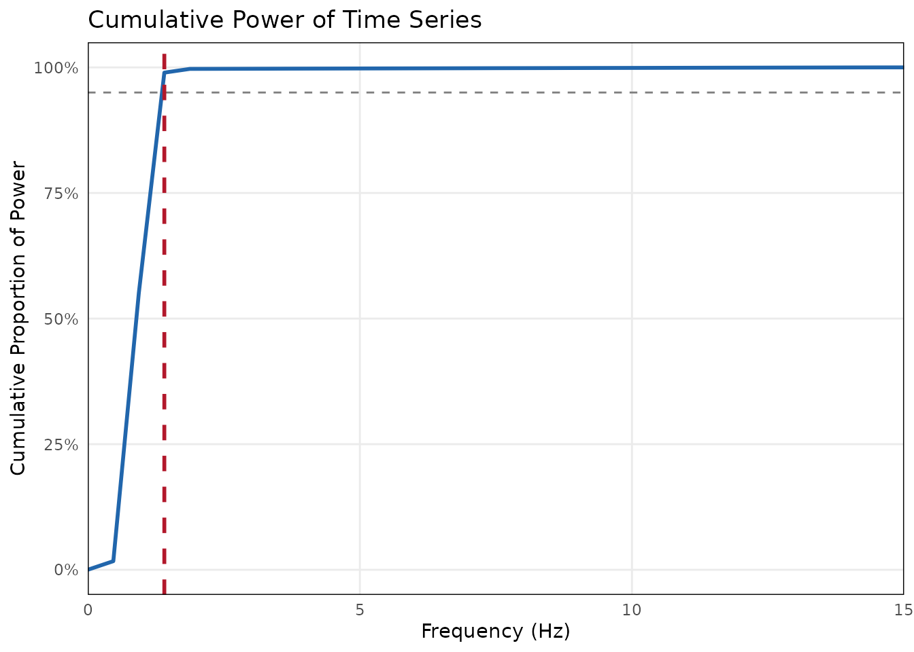
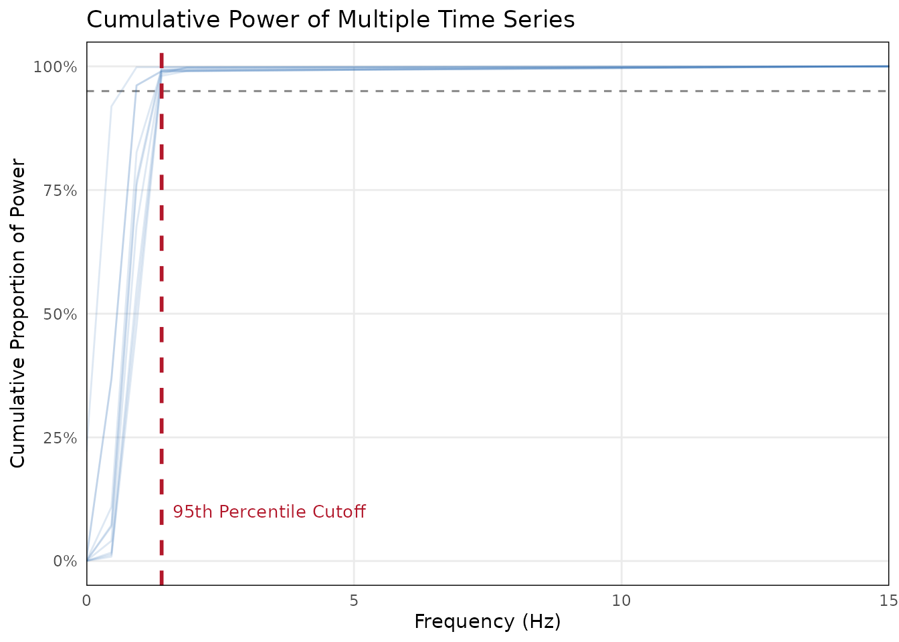

# Determining the Downsampling Rate

When analyzing continuous behavioral data like facial expressions or
kinematics, raw data is often recorded at high frequencies (e.g., 30Hz
or 60Hz). Analyzing dyadic synchrony at these high frequencies is
computationally expensive and highly susceptible to tracking noise and
statistical autocorrelation.

The `bsync` package provides tools to help you empirically determine a
biologically plausible downsampling rate using Welch’s Power Spectral
Density (PSD).

## Setup

First, load `bsync` along with `ggplot2` to view the diagnostic plots.

``` r

library(bsync)
library(ggplot2)
```

## Simulating Behavioral Data

For this tutorial, we will simulate 30Hz continuous smile intensity data
(e.g., AU12 from OpenFace). Genuine facial expressions typically evolve
slowly (between 0.3 Hz and 1.5 Hz). We will add a small amount of
high-frequency white noise to simulate micro-jitter from the automated
tracking software.

``` r

set.seed(42)
fs <- 30 # 30 frames per second

# Generate a list of 10 simulated participant signals
smile_data <- lapply(1:10, function(i) {
  # Randomize interaction length between 45 and 60 seconds
  t_end <- runif(1, 45, 60)
  t <- seq(0, t_end, by = 1 / fs)

  base_freq <- runif(1, 0.3, 1.2) # Genuine slow expression
  noise_level <- runif(1, 0.02, 0.08) # Small tracking jitter

  # Signal (slow wave) + Noise (rapid jitter)
  sin(2 * pi * base_freq * t) + rnorm(length(t), mean = 0, sd = noise_level)
})

names(smile_data) <- paste0("Participant_", 1:10)
```

## Evaluating a Single Time Series

If you are only working with one or two individuals, you can pass a
single numeric vector to
[`evaluate_signal_power()`](https://jmgirard.github.io/bsync/reference/evaluate_signal_power.md).
The function calculates the threshold below which 95% of the signal’s
true variance is captured. The function outputs a conservative target
sampling rate to prevent aliasing.

``` r

# Evaluate just the first participant
single_eval <- evaluate_signal_power(
  x = smile_data$Participant_1,
  sample_rate = fs,
  threshold = 0.95
)
#> 
#> ── Signal Power Evaluation ─────────────────────────────────────────────────────
#> 95% of signal power is captured below 1.41 Hz.
#> ✔ To prevent aliasing, the minimum universal sampling rate is 2.81 Hz.
```


``` r


# View the diagnostic plot
single_eval$plot
```



## Best Practice: Dataset-Level Evaluation

In a real study, you should not calculate different downsampling rates
for different participants. Doing so would make your subsequent Windowed
Cross-Correlation (WCC) parameters represent different amounts of real
time across dyads.

Best practice is to calculate the cutoff frequency for all participants
and choose a single, universal rate.
[`evaluate_signal_power()`](https://jmgirard.github.io/bsync/reference/evaluate_signal_power.md)
natively accepts lists and data frames, making this process completely
automated.

``` r

# Pass the entire list of 10 participants
multi_eval <- evaluate_signal_power(
  x = smile_data,
  sample_rate = fs,
  threshold = 0.95
)
#> 
#> ── Dataset-Level Signal Power Evaluation ───────────────────────────────────────
#> Evaluated 10 signals.
#> 95th percentile of cutoffs is 1.41 Hz.
#> ✔ To prevent aliasing, the minimum universal sampling rate is 2.81 Hz.
```


``` r


# View the dataset-level diagnostic plot
multi_eval$plot
```



When provided with multiple signals, the function calculates the cutoff
for each individual and then conservatively recommends the **95th
percentile** of those cutoffs. This ensures you capture the meaningful
behavioral data even for the participants with the fastest expressions.

## Applying the Downsampling

If our Nyquist minimum is around 2.5 Hz, we need to choose a target rate
slightly higher than that which divides cleanly into our original 30Hz
sample rate.

Valid options would be:

- **3 Hz** (Downsample factor of 10)
- **5 Hz** (Downsample factor of 6)

We can now safely proceed to downsample our entire dataset using
[`bsync::aggregate_by_time()`](https://jmgirard.github.io/bsync/reference/aggregate_by_time.md)
or
[`bsync::downsample_signal()`](https://jmgirard.github.io/bsync/reference/downsample_signal.md)
before running our synchrony analyses.
