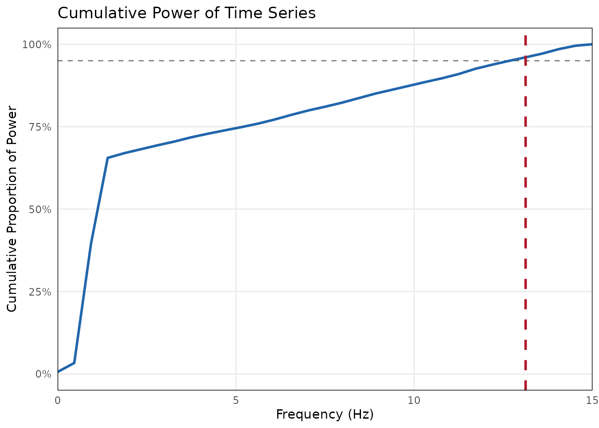
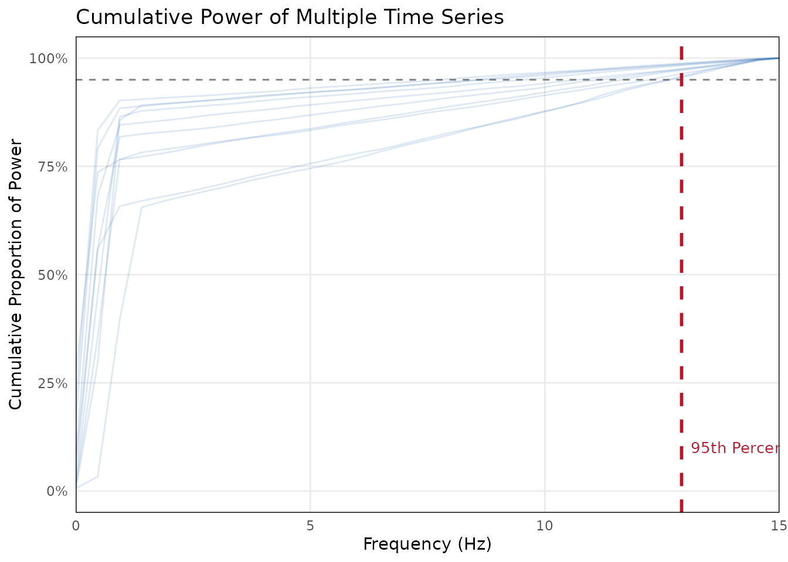

# Determining the Downsampling Rate

When analyzing continuous behavioral data like facial expressions or
kinematics, raw data is often recorded at high frequencies (e.g., 30Hz
or 60Hz). Analyzing dyadic synchrony at these high frequencies is
computationally expensive and highly susceptible to tracking noise and
statistical autocorrelation.

The `bsync` package provides tools to help you empirically determine a
biologically plausible downsampling rate using Welch’s Power Spectral
Density (PSD).

## Setup

First, load `bsync` along with `ggplot2` to view the diagnostic plots.

``` r

library(bsync)
library(ggplot2)
```

## Simulating Behavioral Data

For this tutorial, we will simulate 30Hz continuous smile intensity data
(e.g., AU12 from OpenFace). Genuine facial expressions typically evolve
slowly (between 0.3 Hz and 1.5 Hz), whereas automated tracking noise
fluctuates rapidly.

Let’s simulate a dataset of 10 participants.

``` r

set.seed(42)
fs <- 30 # 30 frames per second
t <- seq(0, 60, by = 1/fs)

# Generate a data frame with 10 simulated participant signals
smile_data <- as.data.frame(
  lapply(1:10, function(i) {
    base_freq <- runif(1, 0.3, 1.2)
    noise_level <- runif(1, 0.2, 0.6)
    
    # Signal (slow wave) + Noise (rapid jitter)
    sin(2 * pi * base_freq * t) + rnorm(length(t), mean = 0, sd = noise_level)
  })
)

colnames(smile_data) <- paste0("Participant_", 1:10)
```

## Evaluating a Single Time Series

If you are only working with one or two individuals, you can pass a
single numeric vector to
[`evaluate_signal_power()`](https://jmgirard.github.io/bsync/reference/evaluate_signal_power.md).
The function calculates the threshold below which 95% of the signal’s
true variance is captured.

``` r

# Evaluate just the first participant
single_eval <- evaluate_signal_power(
  x = smile_data$Participant_1, 
  sample_rate = fs, 
  threshold = 0.95
)
#> 
#> ── Signal Power Evaluation ─────────────────────────────────────────────────────
#> 95% of signal power is captured below 13.12 Hz.
#> ✔ To prevent aliasing, the minimum universal sampling rate is 26.25 Hz.

# View the diagnostic plot
single_eval$plot
```



The function outputs a conservative target sampling rate to prevent
aliasing.

``` r

cat("Recommended Target Rate:", round(single_eval$recommended_target_rate, 2), "Hz\n")
#> Recommended Target Rate: 26.25 Hz
```

## Best Practice: Dataset-Level Evaluation

In a real study, you should not calculate different downsampling rates
for different participants. Doing so would make your subsequent Windowed
Cross-Correlation (WCC) parameters represent different amounts of real
time across dyads.

Best practice is to calculate the cutoff frequency for all participants
and choose a single, universal rate.
[`evaluate_signal_power()`](https://jmgirard.github.io/bsync/reference/evaluate_signal_power.md)
natively accepts data frames and lists, making this process completely
automated.

``` r

# Pass the entire data frame of 10 participants
multi_eval <- evaluate_signal_power(
  x = smile_data, 
  sample_rate = fs, 
  threshold = 0.95
)
#> 
#> ── Dataset-Level Signal Power Evaluation ───────────────────────────────────────
#> Evaluated 10 signals.
#> 95th percentile of cutoffs is 12.91 Hz.
#> ✔ To prevent aliasing, the minimum universal sampling rate is 25.83 Hz.

# View the dataset-level diagnostic plot
multi_eval$plot
```



When provided with multiple signals, the function calculates the cutoff
for each individual and then conservatively recommends the **95th
percentile** of those cutoffs. This ensures you capture the meaningful
behavioral data even for the participants with the fastest expressions.

``` r

cat("95th Percentile Cutoff:", round(multi_eval$primary_cutoff_freq, 2), "Hz\n")
#> 95th Percentile Cutoff: 12.91 Hz
cat("Minimum Universal Target Rate:", round(multi_eval$recommended_target_rate, 2), "Hz\n")
#> Minimum Universal Target Rate: 25.83 Hz
```

## Applying the Downsampling

If our Nyquist minimum is 2.51 Hz, we need to choose a target rate
slightly higher than that which divides cleanly into our original 30Hz
sample rate.

Valid options would be: \* **3 Hz** (Downsample factor of 10) \* **5
Hz** (Downsample factor of 6)

We can now safely proceed to downsample our entire dataset using
[`bsync::aggregate_by_time()`](https://jmgirard.github.io/bsync/reference/aggregate_by_time.md)
or
[`bsync::downsample_signal()`](https://jmgirard.github.io/bsync/reference/downsample_signal.md)
before running our synchrony analyses.
