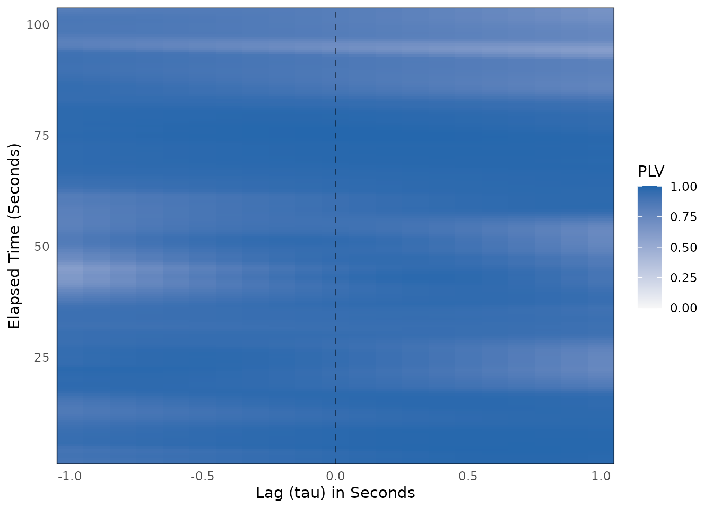
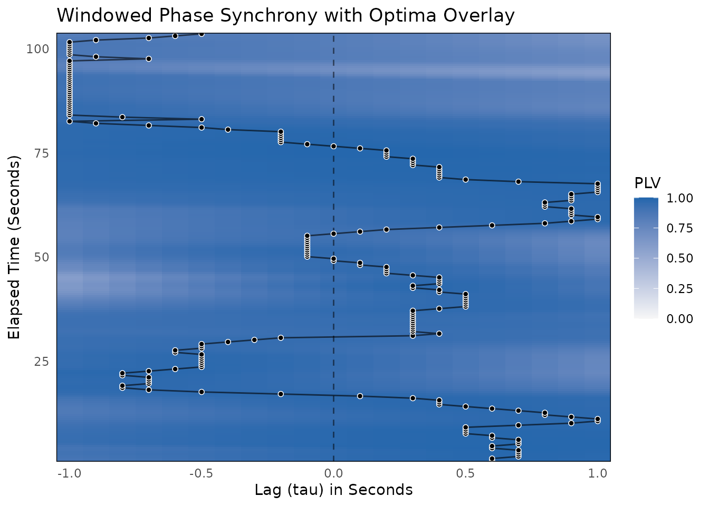

# Windowed Phase Synchrony

This vignette walks through a complete windowed phase synchrony analysis
using the **bsync** package.

Windowed Cross-Correlation (WCC) asks whether two signals rise and fall
together. Phase synchrony asks a narrower question: do two rhythmic
signals keep a stable timing relationship within each cycle, whatever
their amplitudes? Two people swaying, rocking, or nodding at a shared
tempo can be strongly phase-locked even when one moves with much larger
amplitude than the other.

## 1. What is Windowed Phase Synchrony?

[`wphase()`](https://jmgirard.github.io/bsync/reference/wphase.md)
extracts the instantaneous phase of each series once, with the analytic
signal (the Hilbert transform). For each window and lag, it then
summarizes the phase differences between the two series in two numbers:

- **PLV (phase-locking value):** the length of the mean unit vector of
  the phase differences, from 0 to 1. A PLV of 1 means the phase
  difference stays constant across the window. A PLV near 0 means the
  phase difference is spread evenly around the circle. This is the
  phase-locking value of Lachaux et al. (1999), averaged over the time
  samples of a window instead of over trials.
- **Relative phase (`rel_phase`):** the circular mean of the phase
  differences, in radians. Positive values mean that `x` is ahead of `y`
  in its cycle.

### 1.1 The Narrowband Assumption

Instantaneous phase is only well defined for a **narrowband** signal,
which is a signal dominated by one rhythm. Behavioral data rarely look
like that. They usually carry slow drift (posture changes, sensor drift)
and fast measurement noise on top of the rhythm of interest.

This matters because the error is in the dangerous direction. Slow,
broadband drift makes the phases of two series change slowly, so their
difference stays nearly constant across a short window, and the PLV
rises. High PLV on unfiltered data is therefore not evidence of
synchrony. Lachaux et al. (1999) band-pass filter their signals before
extracting the phase, and you should do the same.
[`wphase()`](https://jmgirard.github.io/bsync/reference/wphase.md) does
not filter for you, because a filter changes the data and the choice of
band belongs to you.

**When is windowed phase synchrony useful?**

- **Rhythmic behavior:** rocking, swaying, walking, tapping, nodding,
  breathing, or any behavior with a clear tempo.
- **Timing over amplitude:** when the timing relationship within each
  cycle matters more than how large the movements are.

**When should you avoid it?**

- **Non-rhythmic behavior:** if no single rhythm dominates the signal,
  phase has no clear meaning, even after filtering.
- **Missing data:** the Hilbert transform uses the whole series, so a
  single `NA` corrupts every phase estimate.
  [`wphase()`](https://jmgirard.github.io/bsync/reference/wphase.md)
  stops on `NA` input. Impute with
  [`impute_ts_gaps()`](https://jmgirard.github.io/bsync/reference/impute_ts_gaps.md)
  or trim with
  [`trim_edges()`](https://jmgirard.github.io/bsync/reference/trim_edges.md)
  first.

## 2. Simulating Realistic Dyadic Data

We simulate two people captured at 10 Hz for 2 minutes. Both move with a
shared rhythm near 0.5 Hz (one cycle every 2 seconds). The tempo wanders
slowly over time, as human tempo does, and Person B follows Person A’s
rhythm. Person A leads by 0.5 seconds at the start, and the lead shifts
smoothly until Person B leads by 0.5 seconds at the end.

On top of the rhythm, each person has independent slow drift and
measurement noise.

``` r

library(bsync)

set.seed(2026)

fs <- 10 # sampling rate in Hz
n <- 1200 # 2 minutes of data
t <- (0:(n - 1)) / fs

# A shared tempo near 0.5 Hz that wanders slowly over time
wander <- stats::filter(rnorm(n + 200, sd = 0.6), rep(1 / 50, 50), circular = TRUE)
freq <- 0.5 + as.numeric(wander)[101:(100 + n)]
phase_A <- 2 * pi * cumsum(freq) / fs

# Person B follows Person A: A leads by 0.5 s at the start, B by 0.5 s at the end
lead_sec <- seq(0.5, -0.5, length.out = n)
phase_B <- approx(t, phase_A, xout = t - lead_sec, rule = 2)$y

# Independent slow drift (a strongly autocorrelated AR(1) process) for each person
drift <- function() as.numeric(stats::arima.sim(list(ar = 0.98), n))

person_A <- cos(phase_A) + 0.25 * drift() + rnorm(n, sd = 0.3)
person_B <- cos(phase_B) + 0.25 * drift() + rnorm(n, sd = 0.3)
```

## 3. Band-Pass Filtering Before Phase Extraction

A band-pass filter keeps one frequency band and removes the rest. Here
we keep 0.3 to 0.7 Hz, a band around the shared rhythm. In your own
data, choose the band from theory about the behavior or from the power
spectrum (see
[`vignette("determine-downsampling")`](https://jmgirard.github.io/bsync/articles/determine-downsampling.md)
for
[`evaluate_signal_power()`](https://jmgirard.github.io/bsync/reference/evaluate_signal_power.md)).

We use a Butterworth band-pass filter from the **gsignal** package
(`butter()` with `n = 2`, which gives a 4th-order band-pass) and apply
it with `filtfilt()`, which runs the filter forward and then backward.
This zero-phase filtering does not shift the timing of the signal, which
matters when timing is the thing you measure.

``` r

bp_filter <- gsignal::butter(2, c(0.3, 0.7) / (fs / 2), type = "pass")
band_pass <- function(v) as.numeric(gsignal::filtfilt(bp_filter, v))

person_A_f <- band_pass(person_A)
person_B_f <- band_pass(person_B)
```

To see why this step matters, compare two **independent** drift series,
which share nothing, before and after filtering:

``` r

indep_1 <- drift()
indep_2 <- drift()

plv_indep_raw <- wphase(indep_1, indep_2, window_size = 150, lag_max = 10)$aggregate[[1]]
plv_indep_filt <- wphase(
  band_pass(indep_1), band_pass(indep_2),
  window_size = 150, lag_max = 10
)$aggregate[[1]]
plv_dyad_raw <- wphase(person_A, person_B, window_size = 150, lag_max = 10)$aggregate[[1]]

round(c(
  independent_unfiltered = plv_indep_raw,
  independent_filtered = plv_indep_filt,
  dyad_unfiltered = plv_dyad_raw
), 3)
#> independent_unfiltered   independent_filtered        dyad_unfiltered 
#>                  0.487                  0.332                  0.390
```

The two independent series reach a mean PLV of 0.487 without filtering,
and the coupled dyad reaches only 0.39. Two series that share nothing
score higher than a coupled pair, so a PLV on unfiltered data does not
measure coupling. After filtering, the independent pair drops to 0.332.
That value is still well above 0, because two narrowband signals keep
similar phases over a short window by chance. This is why a surrogate
test (Section 5) is needed to judge any PLV.

## 4. Calculating Windowed Phase Synchrony on the Filtered Pair

Phase synchrony needs windows long enough to hold several cycles. We use
15-second windows (`window_size = 150`, 7.5 cycles of the 0.5 Hz rhythm)
and lags up to 1 second (`lag_max = 10`), which is half a cycle. A
window moves 0.5 seconds at a time (`window_increment = 5`).

``` r

wphase_results <- wphase(
  x = person_A_f,
  y = person_B_f,
  window_size = 150,
  lag_max = 10,
  window_increment = 5
)

print(wphase_results)
#> 
#> ── Windowed Phase Synchrony Analysis ───────────────────────────────────────────
#> Total Windows: 206
#> Total Lags Tested: 21
#> Window Size: 150
#> Max Lag: 10
#> Mean PLV: 0.9104
```

The [`wphase()`](https://jmgirard.github.io/bsync/reference/wphase.md)
function returns a list object of class `wphase_res`. Its `results_df`
has one row per window (`i`, in samples) and lag (`tau`, in samples),
with the `plv` and `rel_phase` of that cell.

The relative phase carries the lead–lag information. At lag 0, divide
the relative phase (in radians) by `2 * pi * 0.5` (the rhythm frequency
in radians per second) to get the lead of Person A in seconds:

``` r

lag0 <- wphase_results$results_df[wphase_results$results_df$tau == 0, ]
lag0$time_sec <- (lag0$i - 1) / fs
lag0$lead_A_sec <- lag0$rel_phase / (2 * pi * 0.5)

rows <- round(seq(1, nrow(lag0), length.out = 5))
round(lag0[rows, c("time_sec", "rel_phase", "lead_A_sec")], 2)
#>      time_sec rel_phase lead_A_sec
#> 2061      1.0      1.45       0.46
#> 2112     26.5      0.62       0.20
#> 2164     52.5     -0.05      -0.02
#> 2215     78.0     -0.43      -0.14
#> 2266    103.5     -1.33      -0.42
```

The estimated lead of Person A moves from 0.46 seconds in the first
window to -0.42 seconds in the last. The simulated lead moved from 0.5
to -0.5 seconds.

## 5. Surrogate Testing for Significance

Section 3 showed that unrelated narrowband signals still give a sizable
PLV. A surrogate test asks whether the observed PLV is larger than the
PLV of pairs whose timing relationship was destroyed.

Circular-shift surrogates
([`generate_surrogate_circular()`](https://jmgirard.github.io/bsync/reference/generate_surrogate_circular.md))
suit phase synchrony well. Each surrogate shifts the whole series of
Person B by a random amount and wraps the end around to the start. The
rhythm of Person B stays intact, but its alignment with Person A is
broken. A shift smaller than the largest lag tested would leave the
alignment within reach of a lagged window, so pass `lag_max` to keep
every shift at least twice that far away.

One caution: a circular shift of a perfectly periodic signal only adds a
constant to its phase, and PLV ignores constant phase offsets. Against a
strictly periodic shared rhythm, this null has no power. Real behavior
has a wandering tempo, as simulated here, which gives the test its
power.

``` r

y_surr <- generate_surrogate_circular(person_B_f, n_surrogates = 1000, lag_max = 10)

surr_mean <- wphase_surrogate(
  x = person_A_f,
  y = person_B_f,
  y_surrogates = y_surr,
  window_size = 150,
  lag_max = 10,
  window_increment = 5
)

print(surr_mean)
#> 
#> ── Windowed Phase Synchrony Surrogate Analysis (Pseudo-Synchrony) ──────────────
#> Permutations: 1000
#> Observed Mean PLV: 0.9104
#> Average Null Mean PLV: 0.4323
#> Empirical p-value: 0.001
#> ✔ Observed phase synchrony is significantly greater than chance.
```

The empirical p-value is (b + 1) / (n + 1), where n is the number of
surrogates and b counts the surrogates whose mean PLV is at least as
large as the observed one. Here the observed mean PLV is 0.91, the
average surrogate gives 0.432, and p = 0.001.

## 6. The Peak Statistic

By default,
[`wphase()`](https://jmgirard.github.io/bsync/reference/wphase.md)
summarizes the surface with the mean PLV over all windows and lags
(`statistic = "mean_plv"`). The alternative, `statistic = "peak"`, takes
the largest PLV across lags in each window and averages those per-window
values. This is the best-lag convention that
[`wcc()`](https://jmgirard.github.io/bsync/reference/wcc.md) also offers
as `statistic = "peak"`. It suits a dyad whose lead–lag shifts over
time, because each window counts at the lag where the phases lock best.

Pass the `statistic` that you report from
[`wphase()`](https://jmgirard.github.io/bsync/reference/wphase.md) to
[`wphase_surrogate()`](https://jmgirard.github.io/bsync/reference/wphase_surrogate.md)
as well, so that the test is of that statistic.
[`wphase_surrogate()`](https://jmgirard.github.io/bsync/reference/wphase_surrogate.md)
summarizes the observed data and every surrogate with it. The same
surrogate matrix can be reused:

``` r

surr_peak <- wphase_surrogate(
  x = person_A_f,
  y = person_B_f,
  y_surrogates = y_surr,
  window_size = 150,
  lag_max = 10,
  window_increment = 5,
  statistic = "peak"
)

print(surr_peak)
#> 
#> ── Windowed Phase Synchrony Surrogate Analysis (Pseudo-Synchrony) ──────────────
#> Permutations: 1000
#> Observed Mean Peak PLV: 0.9511
#> Average Null Mean Peak PLV: 0.4959
#> Empirical p-value: 0.001
#> ✔ Observed phase synchrony is significantly greater than chance.
```

With the peak statistic, the observed value is 0.951 against a surrogate
average of 0.496, and p = 0.001. The peak statistic is at least as large
as the mean statistic for the observed data and for 1000 of the 1000
surrogates, so compare each observed value only with the null of its own
statistic. Choose the statistic before you look at the results.

## 7. Optima Extraction

[`pick_optima()`](https://jmgirard.github.io/bsync/reference/pick_optima.md)
finds the lag with the highest PLV in each window. With
`search_method = "global"`, it returns one optimum per window.

``` r

wphase_optima <- pick_optima(wphase_results, search_method = "global")

summary(wphase_optima)
#> 
#> ── Windowed Phase Synchrony Optima ─────────────────────────────────────────────
#> Total Windows: 206
#> Valid Optima: 206
#> Search Method: global
#> 
#> ── Optimum Lag Distribution ──
#> 
#>     0%    25%    50%    75%   100% 
#> -10.00  -6.75   2.00   5.00  10.00
```

For narrowband signals, PLV changes only slowly across lags, because a
lag shift adds a nearly constant phase offset within a window. The best
lag is then identified only through the tempo wander that the two people
share, and it is a noisy estimate of the lead. Because we simulated the
data, we can compare both estimates with the true lead at the center of
each window:

``` r

center <- wphase_optima$i + 75 # sample at the center of each 150-sample window
true_lead_samples <- lead_sec[center] * fs

cor_optima <- cor(wphase_optima$optimum_lag, true_lead_samples)
cor_rel_phase <- cor(lag0$lead_A_sec, lead_sec[lag0$i + 75])
round(c(optimum_lag = cor_optima, rel_phase_lead = cor_rel_phase), 2)
#>    optimum_lag rel_phase_lead 
#>           0.50           0.98
```

The PLV optima correlate 0.5 with the true lead, and the lead read from
the relative phase at lag 0 correlates 0.98. Of the 206 optima, 44 sit
at the edge of the lag range (-10 or 10 samples), where the search has
no room on one side. In this example, the relative phase is the better
reading of the lead–lag.
[`leadership_asymmetry()`](https://jmgirard.github.io/bsync/reference/leadership_asymmetry.md)
accepts `wphase` optima, but check them against the relative phase
before you use them for a leadership index.

## 8. Visualizing the Results

[`plot()`](https://rdrr.io/r/graphics/plot.default.html) draws the PLV
surface as a heatmap of windows by lags. The `time_step` argument
converts the axes from samples to seconds.

``` r

plot(wphase_results, time_step = 1 / fs)
```



[`plot_optima_overlay()`](https://jmgirard.github.io/bsync/reference/plot_optima_overlay.md)
adds the per-window optima to the same surface:

``` r

plot_optima_overlay(
  surface_obj = wphase_results,
  optima_df = wphase_optima,
  time_step = 1 / fs,
  show_zero_lag = TRUE
)
```



The PLV changes little across lags within a window. Across windows, the
median of the lowest PLV in a window is 0.83, and the median of the
highest is 0.97. This is the flat lag profile described in Section 7.

## See also

- [`vignette("surrogate-testing")`](https://jmgirard.github.io/bsync/articles/surrogate-testing.md)
  for circular-shift, phase-randomization, IAAFT, segment, and
  pseudo-dyad surrogates, and which null each one tests
- [`vignette("choosing-parameters")`](https://jmgirard.github.io/bsync/articles/choosing-parameters.md)
  for tools to choose and check `window_size` and `lag_max`
- [`vignette("determine-downsampling")`](https://jmgirard.github.io/bsync/articles/determine-downsampling.md)
  for reading the power spectrum with
  [`evaluate_signal_power()`](https://jmgirard.github.io/bsync/reference/evaluate_signal_power.md)
- [`vignette("wcc-workflow")`](https://jmgirard.github.io/bsync/articles/wcc-workflow.md)
  for the Windowed Cross-Correlation workflow, which shares the optima
  and leadership pipeline
- Lachaux, J.-P., Rodriguez, E., Martinerie, J., & Varela, F. J. (1999).
  Measuring phase synchrony in brain signals. *Human Brain Mapping*,
  8(4), 194–208.
